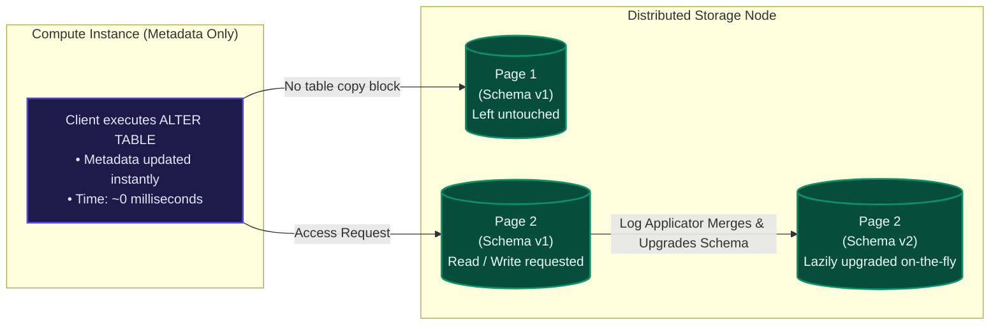
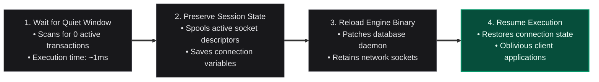

After dissecting the core mechanics of Amazon Aurora—from log-structured storage and 4/6 quorums to smart storage nodes and asynchronous LSN consensus—I was left with the ultimate question: how does all this theory actually play out in production? 

Decoupling layers and moving operations to the background sounds beautiful in design docs, but databases exist to serve real queries under real pressure. 

In this final installment of our series, I want to unpack the real-world operational realities of Aurora—examining actual benchmark performance, how it holds up in real enterprise migrations, and the engineering choices like Lazy DDL and Zero-Downtime Patching (ZDP) that make running it at scale a masterclass in cloud systems engineering.

## 1. Real-World Performance: The Benchmark Results

To understand how this architecture holds up under load, I looked at standard benchmarks comparing Amazon Aurora to community MySQL 5.6 and 5.7 running on equivalent hardware: `r3.8xlarge` instances (32 vCPUs, 244 GB RAM) with dedicated high-performance network-attached storage.

### Scaling with Machine Sizes

Under standard SysBench workloads, Aurora demonstrated near-linear throughput scaling as instances grew. On the largest `r3.8xlarge` instances:
* **Write Throughput**: Aurora achieved **121,000 writes/sec** compared to MySQL 5.7's baseline of ~20,000 writes/sec.
* **Read Throughput**: Aurora scaled to **600,000 reads/sec** compared to MySQL's 125,000 reads/sec.

This represents a consistent **5x performance speedup** across workloads by simply removing checkpoint stalls, dirty page flushes, and double-write buffers from the compute tier.

### Out-of-Cache Workloads (Varying Data Sizes)

Standard relational databases run incredibly fast as long as their active dataset fits comfortably inside the memory buffer pool. But when data sizes swell far beyond RAM, forcing frequent disk I/O, traditional databases hit a wall.

Comparing write-only throughput as database sizes scale reveals a massive difference:
* **1 GB Database (In-Cache)**: Aurora processes 107,000 writes/sec vs. MySQL's 8,400 writes/sec (12.7x speedup).
* **100 GB Database (Out-of-Cache)**: Aurora maintains **101,000 writes/sec** while MySQL plummets to 1,500 writes/sec due to disk I/O thrashing—yielding a **67x speedup**.
* **1 TB Database (Massive Out-of-Cache)**: Even with a dataset four times larger than host memory, Aurora sustains **41,000 writes/sec** while MySQL manages only 1,200 writes/sec (a 34x advantage).

This out-of-cache performance is where Aurora's decoupled, asynchronous page building truly shines: the compute instance never blocks on page flushes, and the smart storage nodes write to local SSDs in parallel.

### Connection Scaling and Hot Row Contention

In traditional MySQL, as client connections scale into the thousands, throughput collapses because of internal lock contention and thread context switching. Under test, when connections scaled to 5,000, MySQL's throughput fell from its peak of 21,000 down to 13,000 writes/sec. Aurora, however, continued to scale, maintaining **110,000 writes/sec** under the same load.

Similarly, under the TPC-C benchmark which simulates transactional hotspots on specific rows (such as warehouse stock level updates), Aurora yielded **2.3x to 16.3x higher throughput** than MySQL 5.7 by offloading write queues and processing transactions lock-free where possible.

### Virtual Elimination of Replica Lag

In a standard MySQL master-replica configuration, a replica has to download the master's binary log, parse it, and apply changes block-by-block. Under heavy write loads, read replicas fall behind the master, with replica lag frequently spiking to 5 minutes (300,000 ms).

In Aurora, because all read replicas mount the same shared storage volume and only consume a lightweight stream of redo log records to update their in-memory buffer pool, replica lag stays virtually flat. At 10,000 writes/sec, standard MySQL replica lag is over 5 minutes, while Aurora's replica lag measures just **5.38 ms**.

## 2. Practical Real-World Migrations

When looking at real production metrics reported from enterprise migrations, the practical benefits of this architecture become very clear:

* **Gaming Workloads**: An internet gaming platform experiencing average transaction response times of 15 ms on standard MySQL saw response times cut down to **5.5 ms** (a 3x speedup) immediately after migrating to an equivalent Aurora cluster, with database CPU utilization dropping from 60% to just 15%.
* **EdTech SaaS**: An education platform managing student device streams suffered from severe P95 tail-latency spikes (often between 40 ms and 80 ms, despite a P50 median of 1 ms). Their standard replica lag also hovered around 12 minutes, making read replicas useless for real-time app pages. Migrating to Aurora flattened their P95 latency down to match their 1 ms median, while replica lag dropped to less than **20 ms**, allowing them to offload reading to replicas and scale out their architecture.

## 3. Operational Lessons: Lazy DDL & Zero-Downtime Patching

Running a database service with thousands of active customers taught the AWS team that real-world operations require more than just raw speed. Schema changes and software updates are major sources of downtime that need architectural solutions.

### Schema Evolution via Lazy Online DDL

In web development frameworks like Rails or Django, schema migrations (`ALTER TABLE`) are common. In standard MySQL, running `ALTER TABLE` requires copying the entire table into a new schema block, which locks writes, consumes massive disk I/O, and can take hours for multi-gigabyte tables.

Aurora solves this by implementing page-level schema versioning, also known as **Lazy Online DDL**.

When you execute an `ALTER TABLE`, Aurora updates the table's version schema in the system metadata instantly. The physical 16KB data pages on the storage nodes are left untouched. 

Only when a page is later read or modified does the storage node detect the schema version mismatch. It then reads the schema history, decodes the old layout, and lazily upgrades the page structure on-the-fly during the write step. This eliminates blocking table copies entirely.

### Zero-Downtime Patching (ZDP)

Software patches, security updates, and database engine upgrades are routine but painful. Even a 30-second restart drops active database connections, terminating client sessions and triggering application errors.

AWS designed **Zero-Downtime Patching (ZDP)** to upgrade the database engine daemon without dropping client connections.

ZDP works by scanning for a brief window—typically less than a millisecond—where there are no active, in-flight transactions. When it finds this quiet window, it spools the active application connection states and network socket file descriptors to local ephemeral storage. 

It then updates the database binary in memory and reloads the engine daemon. The client connections remain established and open at the network layer, experiencing only a brief pause in query execution instead of a connection drop.

## 4. The Broader Landscape: Spanner and Deuteronomy

To really understand where Aurora fits in the distributed database landscape, it helps to compare it to other approaches:

* **Google Spanner**: Spanner uses Two-Phase Commit (2PC), Two-Phase Locking (2PL), and highly accurate GPS/atomic clocks (TrueTime) to coordinate global consistency across multiple write nodes. Aurora takes a different route, optimizing for single-writer relational workloads inside a region. It completely avoids the expensive coordination of Two-Phase Commit by using the shared-storage model and asynchronous LSN math (VDL) we explored in Part 4.
* **Microsoft Deuteronomy**: Deuteronomy separates the database into a Transaction Component (TC) and a Data Component (DC) using Bw-Trees. While Deuteronomy decouples at the logical access level, Aurora decouples at a lower physical block/storage tier. This allows Aurora to keep the query parser, optimizer, and transaction locks of standard MySQL completely intact on the compute instance, maintaining 100% database compatibility.

## Final Summary: The Five Pillars of Aurora

Looking back at this 5-part series, the core breakthroughs of Amazon Aurora boil down to five main pillars:

1. **The Log is the Database**: Offloading log application to storage and sending only redo logs over the network to eliminate write bottlenecks.
2. **4/6 Voting Quorums**: Replicating data 6 ways across 3 AZs using 10GB segments to survive catastrophic data center outages.
3. **Smart Storage Fleet**: Moving database logic to storage servers to run page building and self-healing gossip in the background.
4. **Asynchronous LSN Math**: Coordinating consensus and replica updates using Log Sequence Numbers, enabling sub-10-second crash recovery.
5. **Cloud-Native Operations**: Eliminating runtime interruptions using page-level Lazy DDL and Zero-Downtime Patching (ZDP).

By recognizing that the network cable is the primary bottleneck in cloud environments, AWS database engineers shifted database design away from local disk writes. This architectural pivot has proven that refactoring old assumptions for the cloud can yield massive gains in durability, throughput, and operational uptime.

## Recommended Papers to Read Next

If you have enjoyed breaking down the Amazon Aurora paper, here are several classic distributed systems and database papers to add to your reading list:

### Distributed & Cloud-Native Databases
* **Google Spanner (OSDI '12)**: *\"Spanner: Google’s Globally-Distributed Database\"*
* **Amazon DynamoDB (ATC '22)**: *\"Amazon DynamoDB: A Distributed NoSQL Database Engine Operating at Scale\"*
* **Microsoft Deuteronomy (CIDR '15)**: *\"High Performance Transactions in Deuteronomy\"*

### Consensus & File Systems
* **Raft Consensus (ATC '14)**: *\"In Search of an Understandable Consensus Algorithm\"*
* **The Log-Structured File System (SOSP '91)**: *\"The Design and Implementation of a Log-Structured File System\"*
* **Apache Kafka (NetDB '11)**: *\"Kafka: a Distributed Messaging System for Log Processing\"*
