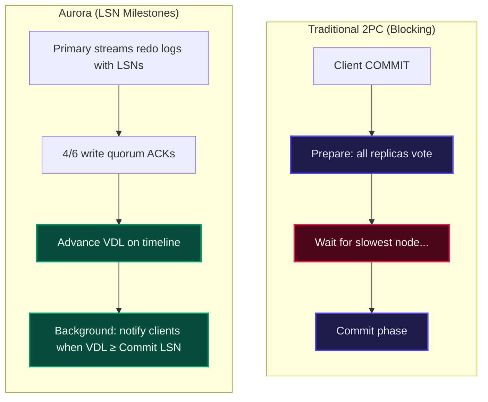
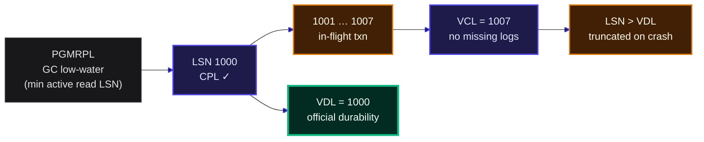
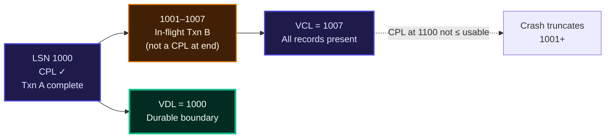
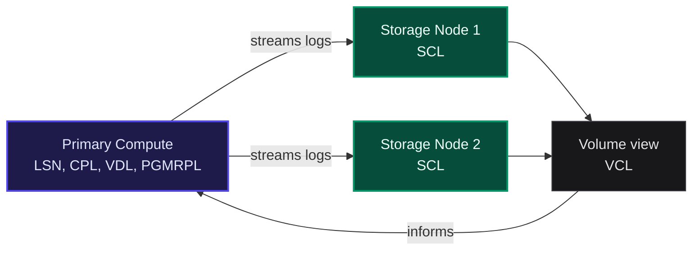
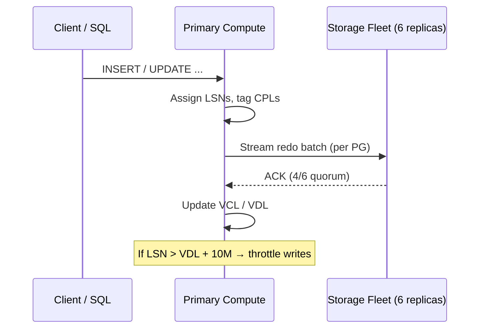
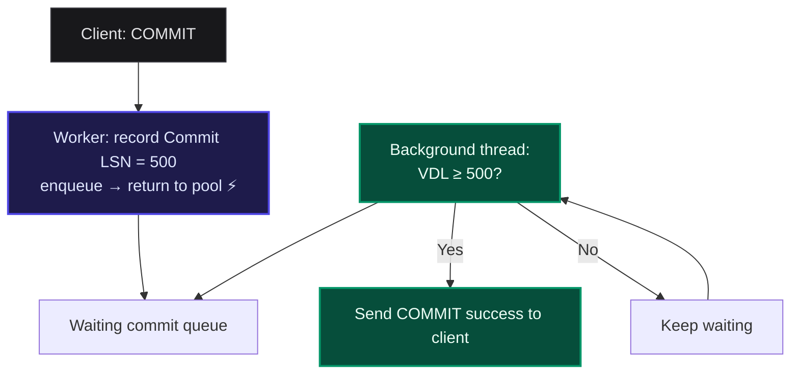
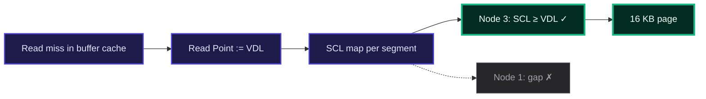
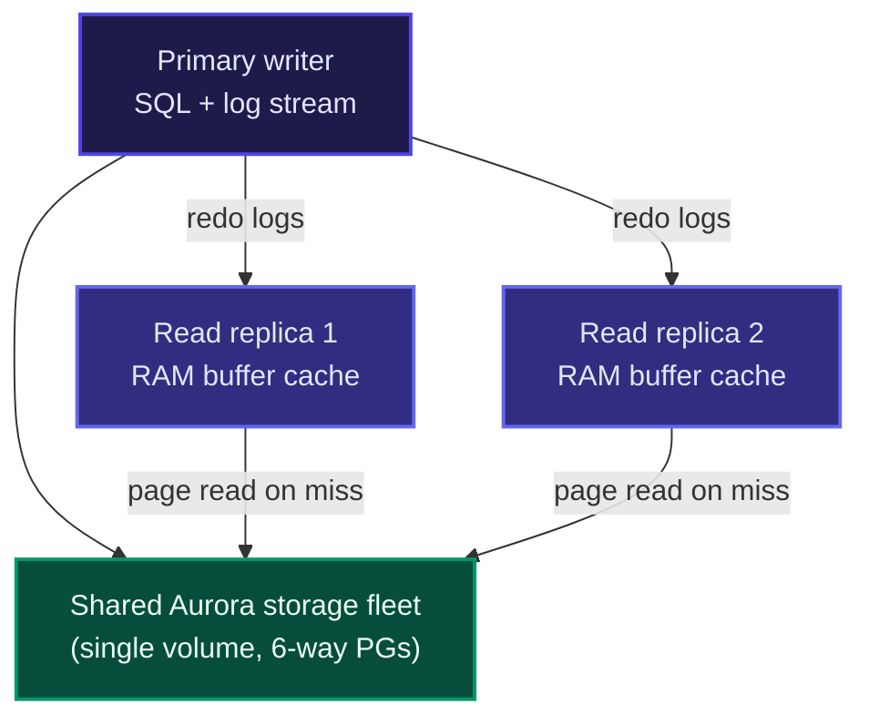
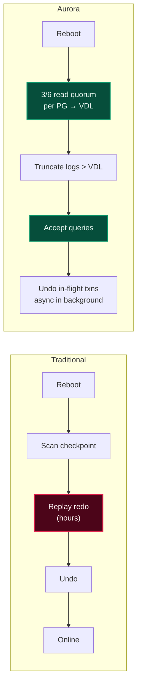

In the first three parts of this series [The Cloud Bottleneck & Why 'The Log is the Database'](/blogs/the-cloud-bottleneck-and-aurora), [Surviving Data Center Fires & The 4/6 Quorum](/blogs/surviving-data-center-fires-and-aurora-quorums), and [Inside a Smart Storage Node & Self-Healing](/blogs/inside-a-smart-storage-node-and-self-healing) we built a picture of Aurora from the outside in: log-only writes, six-way replication, 10 GB Protection Groups, foreground ACKs, background materialization, and peer gossip that heals gaps without bothering the compute tier.

That leaves a question I kept circling while reading Section 4 of the SIGMOD '17 paper. If dozens of storage nodes are applying redo asynchronously, how does the primary engine know what is *actually* durable? How do `COMMIT`, read queries, buffer eviction, and crash recovery stay correct without dragging the whole fleet through **Two-Phase Commit (2PC)**?

Aurora's answer is deceptively simple: treat the database as one monotonically increasing timeline of changes, and track a handful of **Log Sequence Number (LSN)** milestones on that line. Consensus becomes bookkeeping, not a distributed negotiation.

In this post we decode the LSN vocabulary **LSN, CPL, SCL, VCL, VDL, PGMRPL** and walk through writes, commits, reads, read replicas, and recovery the way the paper describes them.

## 1. Why Not Two-Phase Commit?

In classical distributed databases, making every replica agree on transaction outcome often means **2PC**: a prepare phase, a commit phase, and the risk that one slow or unreachable participant freezes everyone.

Cloud networks amplify that pain. Aurora sidesteps 2PC for the storage path. The primary assigns every change a unique LSN; storage nodes ACK receipt; compute advances durability markers when quorums and log continuity allow. Workers do not block on cross-node transaction voting they observe a single advancing **Volume Durable LSN (VDL)**.

## 2. The LSN Alphabet Soup

Think of the redo stream as a single highway where every log record has an exit number. Different roles care about different mile markers on that highway.

### LSN (Log Sequence Number)

A **64-bit, monotonically increasing** identifier attached to every redo record. The **primary compute engine** generates LSNs continuously as SQL and InnoDB mini-transactions (MTRs) produce log entries. The LSN is the coordinate system for the entire system.

### CPL (Consistency Point LSN)

A tag on the **last log record of an atomic unit** typically the end of an MTR. You cannot safely truncate or recover in the middle of a page split or half-applied update; recovery boundaries land on CPLs. Not every LSN is a CPL; CPLs are the fence posts of atomicity.

### SCL (Segment Complete LSN)

Maintained **per storage node, per 10 GB segment**. It is the highest LSN that node has received **with no holes** in the sequence for that Protection Group. Log records chain to their predecessor; if a node has #499 and #501 but missed #500, its SCL stays at **499** until gossip fills the gap (as we saw in Part 3).

### VCL (Volume Complete LSN)

The highest LSN such that **every prior record exists somewhere on the volume** no missing packets in the global sequence up to that point. VCL is about **completeness** of the log chain across the fleet, not yet about which transactions are officially committed.

### VDL (Volume Durable LSN)   the number that matters

**VDL** is the highest **CPL** that is still **≤ VCL**. It is Aurora's **official durability line**:

* Everything with LSN ≤ VDL is fully received, log-continuous, and covered by the **4/6 write quorum** rules that define durable log receipt.
* If the primary crashes, log records **above VDL** are discarded those changes belonged to transactions that had not yet reached a durable consistency point.

> **Intuition:** VCL says "we have all the puzzle pieces up to here." VDL says "among those pieces, the last **finished** transaction boundary we can stand on is here."

In the example above, storage may have contiguous logs through 1007, but if the only CPLs at or below 1007 are at 1000, **VDL stays 1000**. Records 1001–1007 are part of an incomplete transaction and vanish on failure.

### PGMRPL (Protection Group Min Read Point LSN)

For each Protection Group, the primary tracks the **oldest LSN any active query still needs** across the writer and all read replicas. Storage is told: no reader will ever ask for page versions older than **PGMRPL**. That low-water mark lets nodes merge log chains into base pages and **garbage-collect** ancient history safely.

## 3. LSN Roles at a Glance

| Term | Full name | Who maintains it | What it means |
| --- | --- | --- | --- |
| **LSN** | Log Sequence Number | Primary compute | Monotonic ID for every redo record |
| **CPL** | Consistency Point LSN | Primary (on log records) | End of an atomic MTR; safe truncation boundary |
| **SCL** | Segment Complete LSN | Each storage node | Highest contiguous LSN on one 10 GB segment |
| **VCL** | Volume Complete LSN | Storage fleet + compute | Highest LSN with no missing prior records volume-wide |
| **VDL** | Volume Durable LSN | Primary compute | **Official durability:** highest CPL ≤ VCL |
| **PGMRPL** | PG Min Read Point LSN | Primary → pushed to storage | Read low-water; enables safe GC |

## 4. Normal Operations: Writes, Commits, and Reads

With the vocabulary in place, the runtime behavior in Section 4 clicks into place.

### A. Writes and backpressure

1. SQL execution produces redo records; the primary assigns LSNs and marks MTR ends with CPLs.
2. Logs are batched **per Protection Group** and streamed to all six segment replicas.
3. As **4/6** replicas ACK, the primary can advance **VDL** when VCL and CPL rules allow.

Flooding the network is prevented by the **LSN Allocation Limit (LAL)** by default **10 million** LSNs ahead of VDL:

$$\text{Maximum allowed LSN} = \text{VDL} + 10{,}000{,}000$$

If the primary outruns durable storage by more than that margin, **incoming writes are throttled**. Backpressure is automatic: compute speed matches what the fleet can persist.

### B. Commits without blocking worker threads

Classic **Write-Ahead Logging** on a single server often makes the thread that handles `COMMIT` **wait** until the log is on durable media. Under load, that stalls connection pools.

Aurora uses **asynchronous commit acknowledgment**:

1. On `COMMIT`, the worker records the transaction's **Commit LSN**, enqueues it on a wait list, and **immediately** picks up the next client request.
2. A **background thread** watches VDL. When **VDL ≥ Commit LSN**, it sends success to the client.

Durability is unchanged in meaning clients only get ACK after VDL passes their commit point but **foreground workers never sleep on disk**.

### C. Fast reads: one storage node, no read quorum

Quorum math says a **3/6 read quorum** could be needed to intersect the **4/6 write quorum** and see the latest data. In steady state, Aurora usually **skips read quorums**.

The primary maintains an **SCL map** which nodes are contiguous-through which LSN for each segment. On a buffer cache miss:

1. Set **Read Point = VDL** (read only durable-visible state).
2. Pick **one** storage node with **SCL ≥ Read Point**.
3. Fetch the 16 KB page from that node alone.

Read traffic drops from three storage round-trips to **one**, while correctness rests on the engine's knowledge of segment continuity, not on voting at read time.

### D. Buffer eviction without dirty-page flushes

When RAM is full, traditional MySQL may **flush dirty pages** to disk before evicting them another source of stalls.

Aurora compute **never** flushes data pages to the storage fleet. On eviction, if **Page LSN ≤ VDL**, the redo for that page is already durable on storage; the buffer frame can be **dropped immediately**. The log remains the source of truth; RAM is a cache, not a second durability path.

## 5. Read Replicas on Shared Storage

Classic MySQL replication clones disks and replays writes on each replica. Lag under load can reach **minutes**, so "read from replica" is often a consistency gamble.

Aurora supports **up to 15 read replicas** attached to the **same logical storage volume** as the primary:

* Replicas add **no extra copy** of on-disk data they share the Protection Groups.
* The primary **streams redo logs** to replicas in parallel.
* A replica **applies** a log record only if the target page is in its buffer cache; otherwise it **discards** the record (it can always read the page from storage later).

Replica lag typically stays **under 20 ms**, so read scaling offloads real traffic without the stale-read cliff of binlog shipping.

## 6. Instant Recovery: Under 10 Seconds

Traditional crash recovery (e.g. **ARIES**) on restart must find a checkpoint, **replay** large spans of redo, then **undo** uncommitted work often **minutes to hours** of downtime.

Aurora inverts the assumption: storage has been **applying redo continuously** in the background. The compute node does **not** replay the whole log on boot.

**Recovery steps on the primary:**

1. **No bulk redo replay** on compute pages are already materialized or mergeable on storage.
2. Contact a **3/6 read quorum** per Protection Group to learn the latest replicated state and recompute **VDL**.
3. Issue **truncation** to storage for any log above VDL.
4. Bring the instance **online**; **undo** for uncommitted transactions runs **after** new queries are accepted.

The paper reports recovery and query acceptance in **under 10 seconds** even after heavy write load (on the order of 100k write statements per second) because startup work is "where is VDL?" not "replay the world."

## 7. Pulling the Thread

Parts 1–3 showed *what* crosses the network and *how* segments heal. Part 4 is the contract between compute and storage:

* **One LSN timeline** replaces 2PC for log durability.
* **VDL** is the commit line clients ultimately wait on via async ACK, not blocked workers.
* **SCL maps** turn reads into pointed, single-node fetches at **VDL**.
* **PGMRPL** lets storage trim history without breaking snapshots in flight.
* **Shared storage plus log fan-out** makes replicas cheap and low-lag.
* **Recovery** is truncation and undo, not hours of redo replay.

## Coming Up in Part 5...

We have now walked the core engine path from cloud bottleneck through quorums, smart storage, and LSN coordination. In the final installment of this series, we will tie remaining threads from the paper operational lessons, comparisons to traditional MySQL, and what this design means if you are building or operating data systems in the cloud.
