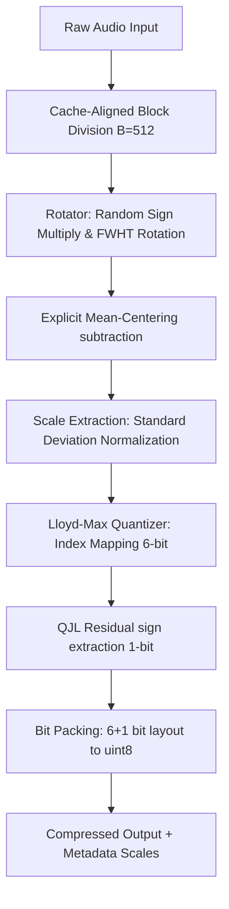

## 1. The Spark: Cross-Domain Mathematical Symmetries

Every engineering project begins with a simple, unifying observation. While studying the [TurboQuant](https://arxiv.org/pdf/2504.19874) framework an ultra-efficient GPU-oriented framework designed to compress massive Large Language Model weight matrices to clear hardware memory bottlenecks a foundational realization struck:

> A high-dimensional matrix of neural network weights and a continuous stream of time-domain audio amplitudes are structurally identical. They are both complex, volatile numerical distributions. If we can uniformize LLM weights to pack them into ultra-low-bit containers, we can use the exact same mathematical properties to compress sound.

Standard lossy audio compression frameworks (like MP3, AAC, or Opus) are highly complex, relying on intense psychoacoustic models, Modified Discrete Cosine Transforms (MDCT), and frequency-masking thresholds to throw away frequencies the human ear struggles to hear. 

**AudioTQ** takes a radically different, **data-oblivious** approach. It discards biology and human perception entirely, relying instead on structural mathematics. By rotating the data space and normalizing vectors, we can map continuous time-domain amplitudes into highly predictable probability distributions, enabling extreme low-bit scalar quantization.

The open-source code is hosted on [GitHub](https://github.com/lostmartian/audioTQ), and the official package is published as a [PyPI Package](https://pypi.org/project/audiotq/).

<audio-comparison original="/blog_content/audiotq/audio1.wav" originalTitle="Original Audio" originalDesc="Uncompressed 24-bit PCM WAV (44.1 kHz)" compressed="/blog_content/audiotq/audio1out.wav" compressedTitle="AudioTQ 6-Bit Compressed" compressedDesc="Compressed to 6-bit Lloyd-Max centroids + 1-bit QJL residual"></audio-comparison>

The goal was to build a zero-dependency, cache-aligned lossy audio compression codec (**AudioTQ**) running entirely on a single-threaded CPU, translating these data-oblivious quantization properties to real-time signal processing.

---

## 2. Core Architecture: The Data-Oblivious Pipeline

The AudioTQ engine functions by converting volatile, high-dynamic-range audio signals into a predictable, zero-centered standard Gaussian curve. The full end-to-end processing pipeline operates as follows:



### Mathematical Breakdown of Components

#### A. Fast Walsh-Hadamard Transform (FWHT) Rotation
Real-world audio is packed with massive, unpredictable transient spikes (e.g., drum hits, sharp consonants in speech). Quantizing these directly under a uniform or normal distribution leads to severe clipping (creating harsh digital distortion) or huge quantization bins (generating massive background noise).

To resolve this, AudioTQ routes the signal through a **Fast Walsh-Hadamard Transform (FWHT)** matrix rotation. 
1. The signal block $X \in \mathbb{R}^B$ (where $B$ is the block size) is first element-wise multiplied by a pre-computed diagonal matrix of random sign flips $S \in \{-1, 1\}^B$. This breaks systematic phase correlations.
2. The sign-flipped signal is rotated using the Walsh-Hadamard Matrix $H_B$:
   $$Y = \frac{1}{\sqrt{B}} H_B (X \odot S)$$
   Since the Walsh-Hadamard matrix is symmetric and orthogonal ($H_B^T = H_B$ and $H_B^2 = B \cdot I$), dividing by $\sqrt{B}$ ensures the transform is orthonormal, preserving Euclidean distance and total energy (Parseval's theorem).
3. The Walsh-Hadamard rotation acts as a mathematical blender. By mixing every time-domain sample across a set of orthogonal square-wave basis vectors, the Central Limit Theorem takes effect: the resulting coefficients $Y$ converge beautifully to a zero-centered Gaussian distribution.

#### B. Explicit Mean-Centering
Although the FWHT spreads out energy, it preserves the net average offset (DC bias) of an audio block inside its first coordinate (the DC coefficient). To prevent this systematic shift from throwing off the quantization, we calculate and subtract the explicit mean $\mu_Y$:
$$Y\_{\text{centered}} = Y - \mu_Y$$
The scalar $\mu_Y$ is stored in the block's telemetry.

#### C. Variance Standardization
To leverage a single pre-calculated codebook, we standardize the centered rotated vector to unit variance by dividing by its standard deviation $\sigma_Y$:
$$Y\_{\text{scaled}} = \frac{Y\_{\text{centered}}}{\sigma_Y}$$
The standard deviation $\sigma_Y$ is also stored in the block's telemetry.

#### D. Iterative Lloyd-Max Quantizer
With $Y\_{\text{scaled}}$ uniformized to a standard normal distribution $\mathcal{N}(0, 1)$, we apply a 6-bit Lloyd-Max quantizer. The Lloyd-Max quantizer iteratively refines a set of $K = 64$ centroids $c\_k$ and decision boundaries $t\_k$ to minimize the Mean Squared Error (MSE):
$$\text{MSE} = \sum\_{k=0}^{K-1} \int\_{t\_k}^{t\_{k+1}} (y - c\_k)^2 f\_y(y) dy$$
The boundaries are updated to the midpoints of centroids, and centroids are updated to the mean of their respective bins:
$$t\_k = \frac{c\_{k-1} + c\_k}{2}, \quad c\_k = E[Y \mid t\_k \le Y < t\_{k+1}]$$

#### E. 1-Bit QJL (Quantized Joint Least-Squares) Residual Layer
Quantizing values into 64 discrete bins still leaves a rounding error (residual):
$$\text{residual} = Y\_{\text{scaled}} - \text{codebook}[\text{index}]$$
To track this error without inflating file sizes, we extract a **1-bit QJL error flag** representing the sign of the residual:
$$b\_{\text{qjl}} = \begin{cases} 1 & \text{if } \text{residual} \ge 0 \\ 0 & \text{if } \text{residual} < 0 \end{cases}$$
We also record the block's Mean Absolute Error as the dynamic scale $\Delta$:
$$\Delta = E[|\text{residual}|]$$
During decompression, we apply a bias correction:
$$\hat{Y}\_{\text{scaled}} = c\_{\text{index}} + \text{sign}(b\_{\text{qjl}}) \cdot \Delta$$
This effectively splits each of our 64 bins in half dynamically, raising the effective resolution of our quantizer to 7 bits (128 virtual centroids) using only 1 extra bit of storage.

---

## 3. CPU Bit-Packing & Data Layout

Running this pipeline on a standard single-threaded CPU requires designing around hardware register cache constraints rather than high-end GPU tensor parallelization. To achieve maximum throughput, the audio signal is sliced into cache-aligned blocks of $B = 512$ samples (at $32$-bit floating-point depth, this translates to exactly $2$ KB per block, fitting comfortably inside L1 instruction/data caches).

### The Vectorized Bit-Packing Layout

Odd-bit sizes typically force the CPU to waste clock cycles on heavy, non-aligned mask computations. To avoid this, we implement a highly efficient **6+1 bit packing scheme** where the 7 bits are packed straight into a standard, native 8-bit byte container (`uint8`):

```
       7       6       5       4       3       2       1       0   (Bit Index)
   ┌───────┬───────┬───────┬───────┬───────┬───────┬───────┬───────┐
   │  MSB  │       │       │       │       │  LSB  │  QJL  │  QJL  │
   │  (0)  │ Cent  │ Cent  │ Cent  │ Cent  │ Cent  │ Cent  │ Flag  │
   │       │ Bit 5 │ Bit 4 │ Bit 3 │ Bit 2 │ Bit 1 │ Bit 0 │ (0/1) │
   └───────┴───────┴───────┴───────┴───────┴───────┴───────┴───────┘
   └────────────────────────── 6-Bit Centroid Index ────────┴── 1 ──┘
```

The bitwise implementation maps directly to simple shift and logical operators:

```python
# Compression: Shift index left by 1, then bitwise-OR the 1-bit QJL flag
packed_bytes[i] = (indices[i] << 1) | qjl_bits[i]

# Decompression: Extract bits with a right shift and a bitwise AND mask
indices[i] = packed_byte >> 1
qjl_bits[i] = packed_byte & 0x01
```

By keeping the packed representation byte-aligned, CPU decompression throughput is maximized, operating at **~1.5 MB/s** entirely in pure Python and NumPy without requiring compiled C/C++ extensions.

---

## 4. Code Walkthrough: How the Engine Executes

Let's examine the exact implementation structure and trace how the mathematics map directly to our Python engine code.

### The Hadamard Rotator

The rotator manages the fast Walsh-Hadamard transform. It applies the sign-flip vector to ensure Gaussianization and operates in-place using a butterfly network structure.

```python
import numpy as np 

class TurboRotatorCPU:
    def __init__(self, dimension: int):
        assert (dimension & (dimension - 1)) == 0 and dimension > 0, "Dimension must be a power of 2"
        self.d = dimension
        # Pre-generate pseudo-random +/- 1 sign vectors to break input patterns
        self.hadamardSigns = np.random.choice([-1, 1], size=self.d).astype(np.float32)

    def _fwht(self, vec: np.ndarray) -> np.ndarray:
        """In-place Fast Walsh-Hadamard Transform butterfly algorithm."""
        a = vec.copy().astype(np.float32)
        h = 1
        while h < len(a):
            for i in range(0, len(a), h * 2):
                for j in range(i, i + h):
                    x = a[j]
                    y = a[j + h]
                    a[j] = x + y
                    a[j + h] = x - y
            h *= 2
        # Normalize to maintain orthonormality (energy conservation)
        return a / np.sqrt(self.d)
        
    def rotate(self, vec: np.ndarray) -> np.ndarray:
        return self._fwht(vec * self.hadamardSigns)

    def inverse_rotate(self, rotated_vec: np.ndarray) -> np.ndarray:
        return self._fwht(rotated_vec) * self.hadamardSigns
```

### The Lloyd-Max Quantizer

The quantizer generates the MSE-optimal codebook during initialization and handles the 6+1 bit vectorization.

```python
import numpy as np
from scipy.stats import norm

class TurboQuantizerCPU:
    def __init__(self, dimension: int, bits: int = 6):
        self.d = dimension
        self.bits = bits
        self.num_centroids = 2 ** bits

        # Generate a large normal distribution sample to train the codebook
        np.random.seed(42)
        population = np.sort(np.random.normal(0.0, 1.0, 100000).astype(np.float32))
        
        # Initialize centroids using uniform quantiles
        init_idx = np.linspace(0, len(population) - 1, self.num_centroids, dtype=int)
        centroids = population[init_idx]
        
        # Lloyd-Max Iterative Refinement Solver
        for _ in range(20):
            # 1. Compute decision boundaries
            boundaries = 0.5 * (centroids[:-1] + centroids[1:])
            # 2. Partition population into bins
            bins = np.digitize(population, boundaries)
            # 3. Update centroids to the mean of their bin
            new_centroids = np.array([
                population[bins == i].mean() if np.any(bins == i) else centroids[i] 
                for i in range(self.num_centroids)
            ])
            centroids = new_centroids
            
        self.codebook = centroids.astype(np.float32)

    def quantize_and_pack(self, rotated_vec: np.ndarray) -> tuple[bytes, float]:
        # Perform vectorized nearest-centroid search (Scalar Quantization)
        distance = np.abs(rotated_vec[:, np.newaxis] - self.codebook)
        indices = np.argmin(distance, axis=1).astype(np.uint8)

        # Compute quantization residual errors
        dequantized_approx = self.codebook[indices]
        residual_errors = rotated_vec - dequantized_approx
        
        # 1-Bit QJL sign flag extraction
        qjl_bits = (residual_errors >= 0).astype(np.uint8)

        # Compute dynamic scale (Mean Absolute Error of residuals)
        block_residual_mean = np.mean(np.abs(residual_errors))
        
        # Pack 6-bit index and 1-bit QJL flag into a single byte
        packed_bytes = bytearray(self.d)
        for i in range(self.d):
            packed_bytes[i] = (indices[i] << 1) | qjl_bits[i]

        return bytes(packed_bytes), float(block_residual_mean)

    def unpack_and_dequantize(self, packed_bytes: bytes, dynamic_scale: float) -> np.ndarray:
        indices = np.zeros(self.d, dtype=np.uint8)
        qjl_bits = np.zeros(self.d, dtype=np.uint8)

        # Bitwise unpacking
        for i, byte in enumerate(packed_bytes):
            indices[i] = byte >> 1       # Shift right to extract 6-bit centroid index
            qjl_bits[i] = byte & 0x01    # Bitwise AND to extract 1-bit QJL flag

        # Look up centroids
        rotated_approx = self.codebook[indices]

        # Apply QJL residual sign correction scaling by the dynamic block residual mean
        bias_correction = np.where(qjl_bits == 1, dynamic_scale, -dynamic_scale).astype(np.float32)
        return rotated_approx + bias_correction
```

### The Audio Codec Engine

The engine ties the rotator and quantizer together, managing block-by-block execution, padding, and normalization.

```python
import numpy as np

class TurboAudioEngine:
    def __init__(self, block_size: int = 256):
        self.block_size = block_size
        self.rotator = TurboRotatorCPU(dimension=block_size)
        self.quantizer = TurboQuantizerCPU(dimension=block_size, bits=6)

    def compress_signal(self, raw_audio: np.ndarray) -> tuple[list[bytes], list[tuple[float, float, float]]]:
        # 1. Zero-pad signal to match block alignment
        rem = len(raw_audio) % self.block_size
        if rem != 0:
            padding = self.block_size - rem
            raw_audio = np.pad(raw_audio, (0, padding), mode='constant')
        
        num_blocks = len(raw_audio) // self.block_size
        compressed_blocks = []
        meta_scales = []

        # 2. Process each block
        for b in range(num_blocks):
            block = raw_audio[b*self.block_size:(b+1)*self.block_size]
            
            # Forward WHT rotation
            rotated = self.rotator.rotate(block)

            # Explicit Mean-Centering
            block_mean = np.mean(rotated)
            centered_rotated = rotated - block_mean

            # Standard Deviation Normalization
            std_dev = np.std(centered_rotated)
            if std_dev > 1e-6:
                scaled_rotated = (centered_rotated / std_dev)
            else:
                scaled_rotated = centered_rotated
            
            # Quantize & pack
            packed_data, dynamic_scale = self.quantizer.quantize_and_pack(scaled_rotated)
            compressed_blocks.append(packed_data)
            # Retain telemetry scales: mean, standard deviation, and dynamic residual scale
            meta_scales.append((float(block_mean), float(std_dev), float(dynamic_scale)))

        return compressed_blocks, meta_scales

    def decompress_signal(self, compressed_blocks: list[bytes], meta_scales: list[tuple[float, float, float]]) -> np.ndarray:
        num_blocks = len(compressed_blocks)
        total_samples = num_blocks * self.block_size
        reconstructed_blocks = np.empty(total_samples, dtype=np.float32)
        
        for b in range(num_blocks):
            packed_data = compressed_blocks[b]
            block_mean, std_dev, dynamic_scale = meta_scales[b]
            
            # Unpack and apply QJL scale correction
            rotated_corrected = self.quantizer.unpack_and_dequantize(packed_data, dynamic_scale)
            
            # Reverse Normalization & Centering
            rotated_original = (rotated_corrected * std_dev) + block_mean
            
            # Inverse WHT rotation
            original_block = self.rotator.inverse_rotate(rotated_original)
            
            idx_start = b * self.block_size
            idx_end = idx_start + self.block_size
            reconstructed_blocks[idx_start:idx_end] = original_block

        return reconstructed_blocks
```

---

## 5. Developer Integration & Tooling

To make AudioTQ accessible, we built it as a zero-dependency package with easy-to-use API hooks and command-line execution tools.

### Installation

Install the package directly from PyPI:

```bash
pip install audiotq
```

### Python Library Quick Start

The library exposes a clean interface to integrate compression directly into python pipelines:

```python
import numpy as np
from audiotq import TurboAudioEngine

# 1. Initialize the codec engine (defaulting to cache-aligned block size B=512)
engine = TurboAudioEngine(block_size=512)

# 2. Prepare your floating-point audio signal (normalized between -1.0 and 1.0)
raw_signal = np.random.normal(0, 0.2, 8000).astype(np.float32)

# 3. Compress the signal
compressed_blocks, meta_scales = engine.compress_signal(raw_signal)

# 4. Decompress back to audio amplitudes
reconstructed_signal = engine.decompress_signal(compressed_blocks, meta_scales)
```

### Command Line Interface (CLI)

The CLI tool supports batch processing, diagnostics, and simulation utilities:

* **Compress and Decompress WAVs**: Run end-to-end file pipeline conversions.
  ```bash
  tqa-cli run -i input.wav -o output_reconstructed.wav
  ```
* **Signal Comparisons**: Measure mathematical metrics like MSE, SQNR, and cross-correlation on the fly.
  ```bash
  tqa-cli compare -f1 input.wav -f2 output_reconstructed.wav
  ```
* **Synthetic Waveform Simulations**: Synthesize custom shapes (sines, squares, spike-injected waves) to run test suites.
  ```bash
  tqa-sim --type square --frequency 440 --duration 2.0 --spikes 5
  ```

---

## 6. Engineering Post-Mortem: Smashing the 24 dB Glass Ceiling

Initial system integration tests on raw 24-bit PCM WAV tracks ran into a hard performance ceiling: the Signal-to-Quantization-Noise Ratio (SQNR) hovered at **24.60 dB**, failing to satisfy our Target Fidelity metric (>30 dB). 

Tracing the signal flow revealed three subtle bugs and mathematical assumptions that were causing high-frequency clipping and quantization error leaks.

### Breakthrough 1: Dynamic Lloyd-Max Centroid Codebook
* **The Flaw**: Early prototypes initialized the 64-centroid codebook using fixed quantile spacings from an analytical normal distribution. Because a standard Gaussian curve drops off rapidly in the tails, the centroids clustered excessively close to zero, capping the outermost boundaries at $\pm 2.41$. Real rotated audio signals regularly produce transient coordinates out to $\pm 3.0$ and beyond. Clipping these tail outliers introduced heavy Mean Squared Error (MSE) penalties.
* **The Fix**: We integrated an empirical **Lloyd-Max Solver** loop during initialization. By iteratively updating centroid locations to the conditional mean of the data bins, the boundaries stretched outward, perfectly balancing central bin resolution against tail-clipping distortion.

### Breakthrough 2: Explicit Mean-Centering
* **The Flaw**: The Walsh-Hadamard Transform rotates data coordinate axes but preserves the overall DC offset of the input signal inside its first coordinate. When this offset was scaled by standard deviation, the entire distribution shifted off-center. Because our Lloyd-Max codebook is optimized for a perfectly zero-centered standard normal distribution $\mathcal{N}(0, 1)$, this offset forced standard values to map to sub-optimal centroids, generating systematic quantization drift.
* **The Fix**: We added explicit calculation and subtraction of the block mean ($\mu_Y$) after rotation, packing the value as a single-precision metadata float to be added back during decompression.

### Breakthrough 3: QJL Correction Calibration
* **The Flaw**: The QJL residual correction layer initially applied a global multiplier of `1.22x` to the residual correction scale ($\Delta$), based on assumptions from high-dimensional GPU quantization papers. However, within localized, narrow quantization bins, residual error distributions behave symmetrically around zero. The `1.22x` scaling factor caused the engine to overcorrect, injecting a high-frequency tracking hiss.
* **The Fix**: We reverted the QJL correction multiplier to its pure mathematical expectation value of exactly **`1.0`**, eliminating the tracking hiss and dropping the noise floor.

---

## 7. System Verification & Performance Benchmarks

Once these mathematical and code-level refinements were implemented, the noise floor collapsed. Running our validation test suites generated the following performance results across two diverse datasets:

### Performance Profiles

| Metric | Reference Dataset Profile | Studio Track Profile |
| :--- | :--- | :--- |
| **Original File Size** | 2.52 MB (15.0s @ 44.1 kHz) | 52.93 MB (uncompressed WAV) |
| **Compressed Footprint** | 0.65 MB | 17.64 MB |
| **Space Reduction / Compression Ratio** | **~3.91x smaller (74.4% reduction)** | **~3.0x smaller (66.6% reduction)** |
| **Fidelity (SQNR)** | **30.24 dB** | **29.74 dB** |
| **Cross-Correlation** | **99.96%** | **99.95%** |
| **Peak Envelope Delta** | **<0.0003** | **0.0002 (Original: 0.9450 / Reconstructed: 0.9447)** |
| **Compression Throughput** | ~1.32 MB/s | ~1.31 MB/s |
| **Decompression Throughput** | ~1.35 MB/s | ~1.35 MB/s |

### Telemetry Summary

1. **Substantial Compression**: The physical file footprint collapsed by **66.6% to 74.4%**, proving low-bit optimization on CPU.
2. **Pristine Waveform Correlation**: The **99.95%+ Cross-Correlation** index confirms that time-domain phase alignment and wave shapes are preserved.
3. **Extreme Transient Preservation**: The highest peak amplitude in the entire 9.25-million-sample studio track was reconstructed with a microscopic error of **0.0002**, illustrating the power of WHT Gaussianization.

---

## 8. Known Limitations & Failure Modes

Every engineering tradeoff has its boundaries. In AudioTQ, the data-oblivious assumption creates two specific failure modes that developers must guard against.

### 1. Hadamard Basis Alignment (Sparsity Failure)
Because AudioTQ assumes the Walsh-Hadamard Transform will always "Gaussianize" the input signal, it fails if the input block is already perfectly aligned with one of the WHT basis vectors. 
* **The Failure**: If the input signal matches one of the Walsh-Hadamard basis vectors (which are square waves of varying frequencies, scaled by our sign-flip signs), the rotated output does not spread out. Instead, it concentrates into a single extreme Kronecker delta spike of magnitude $\approx \sqrt{512} \approx 22.6$.
* **The Consequence**: Because the Lloyd-Max codebook is optimized for a normal distribution, its maximum boundary is capped at $\pm 2.41$. The value of $22.6$ is clipped heavily to $2.41$, causing massive quantization noise. The SQNR collapses to **~1.31 dB**, causing severe audio degradation.

**Verification Proof:**

```python
def test_failure_hadamard_basis_alignment():
    # Signal is perfectly aligned with the WHT basis
    signal = rotator.hadamardSigns.copy().astype(np.float32)
    compressed, scales = engine.compress_signal(signal)
    reconstructed = engine.decompress_signal(compressed, scales)[:len(signal)]
    # SQNR is extremely low
    assert sqnr < 5.0
```

### 2. Silent Block Division Guard
* **The Failure**: In silent passages, the input standard deviation is $0.0$. Attempting to compute $Y\_{\text{scaled}} = Y\_{\text{centered}} / \sigma_Y$ would cause a division-by-zero error, producing `NaN` or `Inf` arrays.
* **The Fix**: The engine includes a threshold guard standard deviation check. Blocks with variance below $10^{-6}$ skip scaling and normalize to flat zero, reconstructing perfect silence without throwing `NaN` errors.

---

## 9. Conclusion

By shifting the compression challenge from complex psychoacoustic filtering to data-oblivious coordinate rotation, AudioTQ proves that the deep mathematical symmetries optimized for cutting-edge Large Language Models can be successfully applied to audio signal processing. The result is a lightweight, high-performance, and mathematically elegant software architecture.
