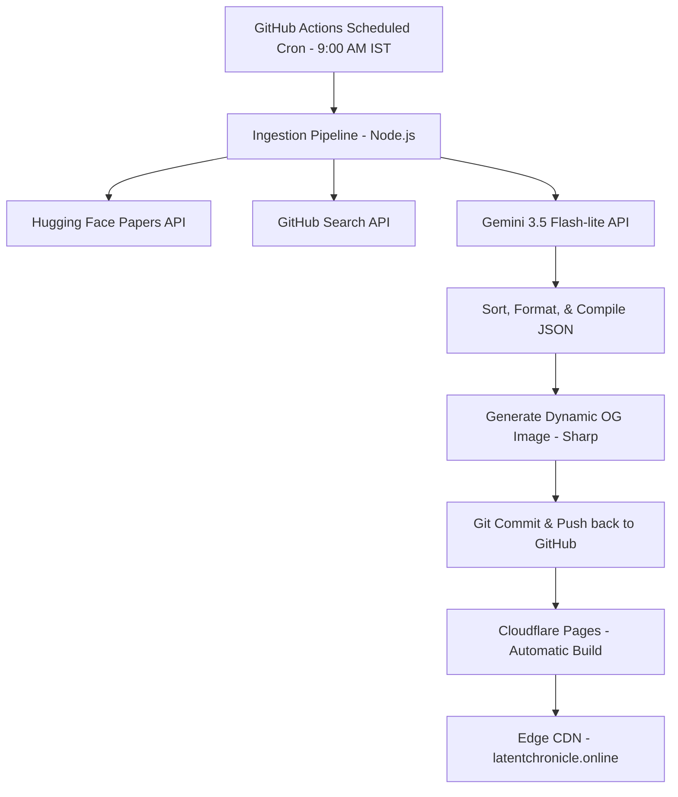

We’ve traded the quiet, high-signal reading of physical media for the firehose of algorithmic feeds. Every day, hundreds of machine learning papers and open-source repositories drop into the ecosystem. Navigating them feels like standing in front of a digital leaf blower.

I wanted a filter. More specifically, I wanted to read today’s high-signal computer science breakthroughs in a format that felt like a quiet Sunday morning. 

So, I built **The Latent Chronicle** ([latentchronicle.online](https://latentchronicle.online/)): a self-updating, retro print-style newspaper displaying daily trending AI papers and viral code repositories. 

And the best part? It operates on a **zero-maintenance, zero-backend, zero-database architecture that costs exactly $0/month to scale to millions of users.**

Here is the story, the tech stack, and the engineering behind it.

## 📰 The Aesthetic: Digital Slow Journalism

The first constraint was design. If it was going to feel like a newspaper, it couldn't look like a standard modern template. No glossy landing page colors, no generic Tailwind grids. 

I settled on a **warm coffee-brown paper background** (#ebdcb9), **deep roasted sepia ink** (#2a1b0d), and **crimson brick-red accents** (#9c2d1b). 

To make the digital layout feel like ink-on-paper:
*   We used classic typography: *Cinzel* for the bold headlines, *Newsreader* for the serif body text, and *Courier Prime* for classified ads.
*   We layered a halftone dot-matrix pattern into the CSS to mimic low-resolution print textures.
*   We packed the grid densely using Tailwind’s `grid-flow-row-dense` (Bento Grid layout) to automatically fill any layout gaps when readers toggle client-side filters.

## 🛠️ The Architecture: An Engineering Blueprint for $0 Scale

Most modern web platforms default to a heavy dynamic stack: a Next.js server, an Express backend, a PostgreSQL database, and Cron-job servers. This stack is great for complex apps, but it introduces operational costs, latency, database connection limits, and hosting bills.

For *The Latent Chronicle*, the architectural mantra was: **Move everything to build time, compile to static files, and distribute via Edge CDN.**

Here is a breakdown of how the components coordinate:

### 1. The Database is a Flat JSON File
Instead of a database server running 24/7, the database is a single flat JSON file (`daily.json`) in the public repository. It stores exactly the top 30 papers and 30 repositories for the current day. 

### 2. The Server is a GitHub Action (The Ingestion Pipeline)
Every morning at exactly **09:00 AM IST**, a scheduled GitHub Actions cron job wakes up. It executes a lightweight Node.js script that fetches data from two sources:
*   **Hugging Face Daily Papers API** (Extracting the top 45 academic papers).
*   **GitHub Search API** (Retrieving the top 45 trending repositories created in the last 7 days).

It ranks them using a **Trend Score** formula that weights academic upvotes against developer stars and recency.

### 3. The Chief Editor is Gemini 3.5 Flash-Lite
Academic abstracts are dense and GitHub readmes are full of developer jargon. To turn them into punchy news briefs, we pass the top stories to Google's **Gemini 3.5 Flash-Lite**.

Using a structured JSON schema, Gemini acts as our vintage chief editor, translating dry abstracts into single-sentence headlines and categorizing them (`cs.CV` for computer vision, `GitHub` for code repos). 

Because the script runs in less than 5 seconds and parses limited text, it fits entirely inside Google AI Studio's **free tier**. The cost logged at the end of each run is routinely **$0.0014** well below the billing threshold.

### 4. Dynamic Open Graph Image Generator (Sharp)
When sharing links on Twitter/X or Slack, standard static sites show a generic logo. I wanted the shared preview card to display the *actual current headlines* of today’s issue.

During the build step, a Node script generates a 1200x630 SVG template mapping out the double borders, the current date, the issue volume in Roman numerals, and the top 3 headlines. It uses the `sharp` library to instantly render this SVG into a PNG image (`public/assets/og-image.png`). 

When shared, platforms pull this freshly compiled image, presenting a dynamically updated newspaper preview.

### 5. Infinite Scaling via Cloudflare Pages
Once the GitHub Action completes, it commits the updated `daily.json` and `og-image.png` back to the GitHub repository. 

This commit triggers **Cloudflare Pages**, which pulls the latest commits, compiles the static Astro framework inside 1 second, and distributes the static HTML/CSS files across its global Edge CDN. Because there are no database queries or server-side rendering execution times, the site can scale to millions of concurrent hits for **exactly $0/month** at sub-millisecond speeds.

## 📈 Real-Time, Rate-Limit Friendly Views

Even a static site needs to show how many people are reading. But spinning up a backend server just to count page views defeats the purpose of a static architecture.

I integrated a client-side view counter using `counterapi.dev`. However, client-side polling in high-traffic scenarios can easily trigger rate limit blocks. To make the counter professional and rate-limit compliant, I wrote a visibility-aware script:
1.  **Read/Write Segregation:** The page only makes a single *write* request (`/up`) on initial load to register the user's visit.
2.  **30-Second Polling:** It polls a read-only endpoint every 30 seconds to fetch the updated global reader count. Reading does not count towards API daily limits.
3.  **Visibility Lock:** Using `document.hidden`, the script automatically **pauses polling** if the user minimizes the tab or switches to another window, protecting the public API server from useless spam.
4.  **Micro-Animation:** When a new reader joins, the view count text triggers a CSS keyframe animation that scale-transforms and flashes from amber to sepia, making the dashboard feel alive.

## 💡 The Takeaway: Return to Simplicity

Building **The Latent Chronicle** was a reminder of how powerful the static web can be. By moving calculations to build time, leveraging serverless crons, utilizing AI API free tiers, and deploying to Edge CDNs, we can build highly functional, beautiful web applications that run indefinitely at zero cost.

Grab a cup of coffee and read today’s dispatches at [latentchronicle.online](https://latentchronicle.online)!
