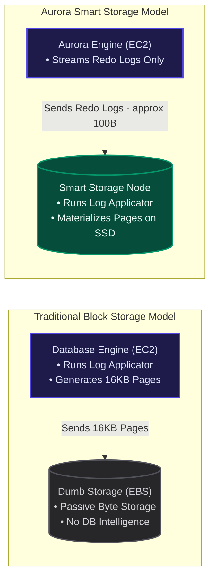
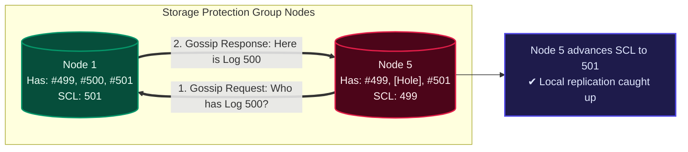

In the first two parts of this series [The Cloud Bottleneck & Why 'The Log is the Database'](file:///Users/lostmartian/Desktop/interview/portfolio/src/content/blogs/the-cloud-bottleneck-and-aurora.md) and [Surviving Data Center Fires: Durability & The 4/6 Quorum](file:///Users/lostmartian/Desktop/interview/portfolio/src/content/blogs/surviving-data-center-fires-and-aurora-quorums.md) we explored how Amazon Aurora decouples compute from storage and leverages a 6-way replicated storage fleet across three Availability Zones to build a resilient database.

But as I dug deeper into the SIGMOD '17 paper, a crucial question arose: if the compute engine only writes lightweight redo log records across the network, how do actual 16KB data pages get built? And what happens when a storage node misses some incoming log packets due to network noise? How does it catch up without slowing down active client transactions?

To answer this, we need to go inside the black box of an Aurora Storage Node. In this post, we will unpack Section 3 of the paper to look at the storage lifecycle, asynchronous background processing, and self-healing peer-to-peer gossip.

## 1. Dumb vs. Smart Storage: Moving Code to Data

To appreciate why Aurora's storage engine is special, we have to look at how traditional cloud storage operates.

In a standard setup where a database compute node writes to passive attached block storage (like AWS EBS), the storage drive is fundamentally \"dumb.\" It is an array of sector addresses that reads and writes bytes on command. It has no understanding of database pages, transactions, or redo logs. 

Because the storage drive lacks database intelligence, the database compute engine has to do all the work. It must run the log applicator in CPU, construct the updated 16KB data page in RAM, and push the full page over the network to the drive during checkpoints.

Aurora flips this paradigm by moving the log applicator code directly onto the storage nodes. Each storage server is an active virtual machine running dedicated software with its own CPU and SSDs. 

By delegating the log application task to the storage tier, the compute engine is freed from running CPU-intensive page rebuilding, allowing it to spend more clock cycles handling active client queries.

## 2. Foreground vs. Background: The Critical Path

In high-throughput database systems, latency is everything. The duration of the critical write path foreground processing determines how long a client waits for a transaction commit confirmation.

If a storage node stops to execute maintenance tasks, write backup snapshots, or validate checksums while handling a write request, client latency spikes. 

Aurora addresses this by dividing storage operations into a fast foreground path (2 steps) and a non-blocking asynchronous background path (6 steps). This ensures that heavy database maintenance never blocks client writes.

## 3. The 8-Step Lifecycle of a Storage Node

When redo log records arrive at a smart storage node, they undergo a structured 8-step process. 

### Foreground Processing (Fast Path)

* **Step 1: Receive Log in Memory**: The storage node pulls incoming redo log records from the primary compute instance and places them into an in-memory queue.
* **Step 2: Persist Log & ACK**: The node writes the log record to its local SSD queue and immediately sends an ACK back to the compute engine. 

Once four out of six storage nodes complete Step 2, the write is considered durable and the client transaction is committed. The remaining steps run asynchronously in the background.

### Background Processing (Asynchronous Path)

* **Step 3: Organize Logs & Detect Gaps**: The node parses Log Sequence Numbers (LSNs) to place out-of-order log records into proper sequence and identifies any missing records.
* **Step 4: Peer Gossip**: If a node detects a hole in its log sequence, it communicates directly with its five peer nodes in the Protection Group to request and copy the missing records.
* **Step 5: Page Coalescing (Materialization)**: The node runs the Log Applicator to merge a chain of accumulated log records into the base page on disk, creating an updated 16KB data page.
* **Step 6: Stream Backups to S3**: The node streams raw logs and materialized pages to Amazon S3 to support continuous backups and point-in-time recovery.
* **Step 7: Garbage Collection**: Old, obsolete page versions and log records that are no longer needed are purged to reclaim disk space.
* **Step 8: CRC Checksum Validation**: Background workers scan disk sectors and check CRC checksums to proactively identify and repair bit rot before pages are read by user queries.

### Negative Correlation of Storage Load

In traditional databases, background operations are positively correlated with load: when traffic increases, page dirtying increases, forcing more aggressive checkpointing and disk writes. This causes I/O thrashing during peaks.

In Aurora, storage processing is negatively correlated: during high write peaks, storage nodes defer background work (Steps 3–8) and focus almost entirely on foreground logging and ACKing (Steps 1 & 2). When user write traffic drops, the storage nodes use their idle CPU cycles to catch up on page coalescing and backups.

## 4. Database Checkpointing vs. Page Materialization

One of the most radical departures in Aurora's architecture is how it eliminates global database checkpoints.

In traditional databases like standard MySQL (using the InnoDB engine), modifications to rows write to a Redo Log and update pages in the memory buffer pool. Over time, these pages become \"dirty.\" To prevent recovery from taking hours if a crash occurs, the engine runs a **Checkpoint** it slows down incoming writes, scans the buffer pool, and flushes hundreds of heavy 16KB dirty pages to disk across network interfaces. This causes major performance jitter.

Aurora replaces this with per-page asynchronous materialization:
* Page materialization is entirely local to the storage nodes.
* It happens on a per-page basis, only merging logs when a specific page accumulates a long chain of pending log modifications.
* Crucially, page materialization is entirely optional for correctness. The database engine considers the redo log records to be the ultimate source of truth (\"The Log is the Database\"). If a page is requested and has unmerged logs, the storage node merges them on-the-fly. Local materialization is simply an optimization to limit on-the-fly read latency.

## 5. Peer-to-Peer Gossip and Self-Healing

Cloud networks are noisy. What happens if a storage node fails to receive a log record due to a packet drop?

If the primary database compute engine writes log record #500, and four nodes receive it and ACK, the write quorum is met and the transaction completes. But suppose Node 5 was down or experienced a network hiccup and missed log #500. It receives log #501 later. 

Instead of forcing the compute engine to track and re-transmit missing records, Aurora shifts this recovery to the storage nodes using a peer-to-peer gossip protocol.

Each storage node tracks its **Segment Complete LSN (SCL)**, which represents the highest contiguous LSN it has received without any holes. Node 5 identifies its SCL as 499. Because it sees a log record with LSN 501, it detects a gap at LSN 500.

Node 5 broadcasts a gossip request to its peers in the Protection Group. Node 1 receives the request, sees that its own SCL is 501, and sends a copy of log record #500 directly to Node 5. Node 5 inserts it, advances its SCL to 501, and heals its log gap automatically.

This gossip mechanism provides major operational wins:
* **Zero Compute Overhead**: The compute engine is never involved in re-transmissions.
* **Auto-Healing**: Nodes that reboot or recover from disk errors catch up automatically in the background without operator intervention.

In the next part of this series, we will examine how the Aurora compute engine coordinates read operations, client transactions, and database recovery across this smart, self-healing storage layer.
