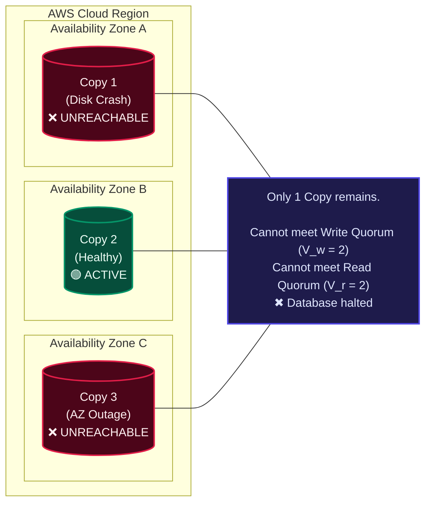
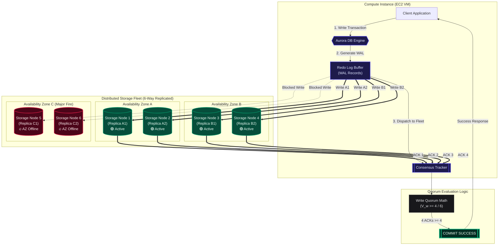
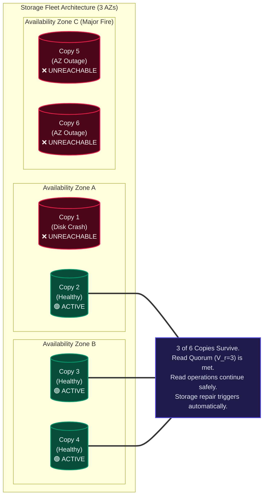
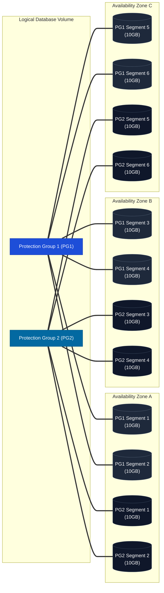

In the first part of this series, [The Cloud Bottleneck & Why 'The Log is the Database'](file:///Users/lostmartian/Desktop/interview/portfolio/src/content/blogs/the-cloud-bottleneck-and-aurora.md), we looked at how Amazon Aurora decoupled compute from storage and shifted the log application process down to an intelligent, distributed storage fleet. This solved the massive write amplification and network bottlenecks that plague traditional databases running in the cloud.

But decoupling compute from storage introduces a new, formidable engineering challenge: how do you guarantee data durability when your database is spread across hundreds of independent storage drives in a massive cloud platform? 

If a physical drive dies, a rack loses power, or an entire data center building catches fire, how does the database ensure that a committed transaction is never lost or corrupted?

In this post, we will unpack Section 2 of the SIGMOD '17 Aurora paper, exploring cloud failure modes, quorum voting math, the 6-way replication scheme, and why 10GB storage segmentation is a game-changer for durability.

## 1. The Cloud Reality: \"Background Noise\" vs. Correlated Failures

When running a database on a single dedicated on-premises server, a drive failure is a rare, catastrophic event. But in a massive cloud infrastructure like AWS, hardware failures are continuous \"background noise.\" 

At any given minute across a cloud fleet, minor issues are always happening:
* An SSD drive experiences read/write errors.
* A virtual machine host reboots due to hypervisor maintenance.
* A network switch drops packets due to transient congestion.

These individual, independent glitches are called **Uncorrelated Failures**.

### The Deadly Threat of Correlated Failures

While individual disk failures happen randomly, some events take down large groups of hardware at the exact same time. These are **Correlated Failures**.

To isolate cloud systems from widespread physical disasters, AWS regions are divided into **Availability Zones (AZs)**. An Availability Zone is one or more discrete physical data center buildings equipped with independent power, cooling, and network security. 

While AZs are designed to be isolated from one another, a major physical disaster—such as a power grid blackout, a roof collapse, or a severe flood—can take an entire Availability Zone offline in a single instant.

Aurora’s durability goal was highly ambitious: the database must survive the loss of an entire Availability Zone going completely dark plus a simultaneous random disk crash in another Availability Zone, without losing data or stopping write availability.

## 2. Why Traditional 2/3 Quorums Fail in the Cloud

To manage data consistency across replicated servers, distributed systems rely on **Quorum Voting Protocols**.

### How Quorum Voting Works

Suppose you store $V$ total copies (replicas) of a data item:
* **Write Quorum ($V_w$):** The number of positive votes (acknowledgements) required from replicas before a write is considered successfully committed.
* **Read Quorum ($V_r$):** The number of replicas you must query when reading data.

To maintain strict consistency, quorum protocols must follow two fundamental rules:
1. **Rule 1 ($V_r + V_w > V$):** The read quorum and write quorum *must overlap*. This guarantees that whenever you read from $V_r$ nodes, at least one node is guaranteed to have received the latest write from $V_w$.
2. **Rule 2 ($V_w > V / 2$):** Two concurrent write quorums cannot overlap. This prevents two clients from writing conflicting updates to different halves of the system simultaneously (split-brain).

### The Standard 3-Copy Model (2/3 Quorum)

A classic approach in cloud storage is 3-way replication across 3 Availability Zones (1 copy per AZ):
* **Total Votes ($V$):** 3
* **Write Quorum ($V_w$):** 2 votes needed out of 3
* **Read Quorum ($V_r$):** 2 votes needed out of 3 (since $2 + 2 = 4 > 3$)

This design can handle the failure of any single node or any single AZ. But what happens during a real-world cloud scenario when multiple failures occur?

Imagine AZ C suffers a sudden power outage, taking Copy 3 offline. At the exact same time, a drive in AZ A dies due to normal \"background noise\" failure, taking Copy 1 offline.

Now, you are left with only 1 surviving copy out of 3. Because you cannot gather 2 votes out of 3, your read and write quorums are completely broken. Your database halts, and you cannot even read data safely because you cannot determine if the remaining copy has the latest committed transaction.

## 3. Aurora’s Solution: The 4/6 Quorum Model

To survive correlated AZ outages combined with background disk failures, AWS engineers designed the **4/6 Quorum Model**.

Aurora replicates every item of data 6 ways across 3 Availability Zones (2 copies in each AZ).

* **Total Copies ($V$):** 6
* **Write Quorum ($V_w$):** 4 votes needed out of 6
* **Read Quorum ($V_r$):** 3 votes needed out of 6 (since $3 + 4 = 7 > 6$)

### How 4/6 Quorums Handle Disaster Scenarios

#### Scenario A: An Entire Data Center Goes Dark (AZ Failure)
If AZ C crashes, Copies 5 and 6 are lost. However, Copies 1, 2, 3, and 4 are still online. Since 4 copies remain, we satisfy $4 \ge V_w (4)$. Write availability is unaffected, and users can continue executing query modifications with zero interruption.

#### Scenario B: Data Center Fire + Simultaneous Disk Crash (AZ + 1 Failure)
If AZ C crashes (Copies 5 and 6 lost) and a drive in AZ A dies (Copy 1 lost), only 3 copies remain online (2, 3, and 4).

While $3 < V_w (4)$ (writes are temporarily paused), we still satisfy $3 \ge V_r (3)$. Read availability is preserved. Aurora can read the state, rebuild the missing write quorums on new storage nodes, and restore full write capability without data loss.

## 4. Segmented Storage: Shrinking MTTR to Seconds

Writing 6 copies of a multi-terabyte database volume across a network fabric sounds expensive and slow. How does Aurora keep performance high while enforcing 6-way replication?

Aurora achieves this through **Storage Segmentation**.

Instead of treating a database as one giant virtual disk, Aurora partitions the entire storage volume into small, fixed-size **10 GB Segments**. Each group of 6 replicated 10GB segments across 3 AZs is called a **Protection Group (PG)**. A full Aurora database volume is simply a collection of concatenated Protection Groups that automatically scales up as data grows.

### Why 10 GB? The Magic of MTTR

In reliability engineering, durability is a race between two variables:
1. **MTTF (Mean Time to Failure):** How long before a hardware drive crashes.
2. **MTTR (Mean Time to Repair):** How fast you can re-replicate lost data to a new drive.

If a large 10 TB drive dies, re-replicating that much data over a crowded network can take hours. During those long hours, the system is vulnerable to a second failure breaking the quorum.

By shrinking the unit of failure down to a 10 GB segment, Aurora can repair a dead segment over a 10 Gbps network link in just 10 seconds. For Aurora to suffer actual data loss, two independent 10GB segment crashes must occur within the exact same 10-second window, alongside a simultaneous failure of an entire Availability Zone. In practice, the mathematical probability of this happening is virtually zero.

## 5. Operational Advantages of Resilience

Designing a storage service to survive major cloud outages provides massive day-to-day operational benefits. Because the 4/6 write quorum tolerates transient node unavailability, AWS engineers can perform routine fleet maintenance without scheduling customer downtime:

* **Heat Management:** If a storage host becomes overcrowded or hot, Aurora marks the local 10GB segment as unhealthy. The system automatically migrates the segment to a cooler node in the background while 4/6 quorum writes continue seamlessly elsewhere.
* **Rolling Software Upgrades:** Security patches and OS updates are deployed one Availability Zone at a time. Because no more than one segment in any Protection Group is patched simultaneously, storage maintenance causes zero downtime for running applications.

Now that we know how Aurora replicates data across 6 storage nodes and survives data center outages, how do individual storage nodes process incoming writes so quickly without slowing down the database engine? We will explore that in the next part of this series.
