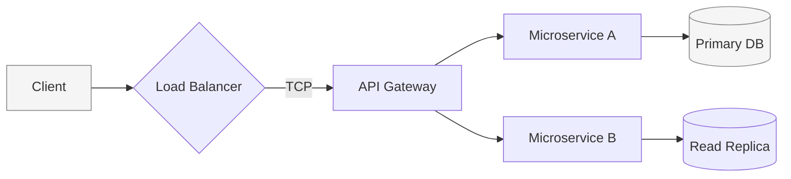

# H1: System Architecture Blueprint

This manifesto outlines the core principles of building resilient, scalable, and aesthetically authoritative systems. It serves as both a philosophical guide and a technical template for future documentation.

## H2: The Core Principles

Building for the future requires a balance of **minimalism** and **dense technical utility**.

### H3: Hierarchy of Authority
1. **Typography**: High contrast and rhythm.
2. **Data**: Dense, scrollable, and industrial.
3. **Media**: Interactive and theme-aware.

---

## H2: Advanced Diagramming (Mermaid)

The system supports complex technical visualizations that automatically adapt to your chosen theme.



---

## H2: Industrial Data Matrices

Technical data should be presented in dense, readable tables. The system supports full-width, scrollable matrices for complex datasets.

| Parameter | Type | Default | Description |
|:---|:---|:---|:---|
| `buffer_size` | `Integer` | `1024` | The size of the allocation buffer in kilobytes. |
| `retry_policy` | `Enum` | `EXP_BACKOFF` | Strategy for handling transient connection failures. |
| `max_latency` | `Float` | `0.05` | Maximum allowed latency threshold before failsafe trigger. |
| `security_level` | `String` | `AUTH_V4` | Protocol version for encrypted handshakes. |

---

## H2: Wide Matrix Stress Test (40 Columns)

This table demonstrates the horizontal scrolling capability for massive technical datasets.

| C1 | C2 | C3 | C4 | C5 | C6 | C7 | C8 | C9 | C10 | C11 | C12 | C13 | C14 | C15 | C16 | C17 | C18 | C19 | C20 | C21 | C22 | C23 | C24 | C25 | C26 | C27 | C28 | C29 | C30 | C31 | C32 | C33 | C34 | C35 | C36 | C37 | C38 | C39 | C40 |
|:---|:---|:---|:---|:---|:---|:---|:---|:---|:---|:---|:---|:---|:---|:---|:---|:---|:---|:---|:---|:---|:---|:---|:---|:---|:---|:---|:---|:---|:---|:---|:---|:---|:---|:---|:---|:---|:---|:---|:---|
| VAL | VAL | VAL | VAL | VAL | VAL | VAL | VAL | VAL | VAL | VAL | VAL | VAL | VAL | VAL | VAL | VAL | VAL | VAL | VAL | VAL | VAL | VAL | VAL | VAL | VAL | VAL | VAL | VAL | VAL | VAL | VAL | VAL | VAL | VAL | VAL | VAL | VAL | VAL | VAL |
| DATA | DATA | DATA | DATA | DATA | DATA | DATA | DATA | DATA | DATA | DATA | DATA | DATA | DATA | DATA | DATA | DATA | DATA | DATA | DATA | DATA | DATA | DATA | DATA | DATA | DATA | DATA | DATA | DATA | DATA | DATA | DATA | DATA | DATA | DATA | DATA | DATA | DATA | DATA | DATA |

---

## H2: Multi-Language Syntax Highlighting

Code blocks are optimized for readability with high-fidelity syntax highlighting.

#### TypeScript Implementation
```tsx
const initialize = (config: SystemConfig): string => {
  return `PROTOCOL_${config.id}_INIT`;
};
```

#### Python Utility
```python
def process_telemetry(data: dict) -> bool:
    if data.get("status") == "CRITICAL":
        trigger_failsafe()
        return True
    return False
```

---

## H2: Rich Media Integration

The system automatically detects URLs and renders them as interactive embeds.

### Playable Technical Brief (YouTube)
https://www.youtube.com/watch?v=dQw4w9WgXcQ

### Real-time Industry Insight (Twitter/X)

You can use full URLs or direct Tweet IDs.

**Direct ID:**

1889059531625464090

**Full URL:**

https://x.com/sama/status/1889059531625464090

---

## H2: Typographic Elements

Blockquotes and lists are refined for clear information hierarchy.

> "True simplicity is not just the absence of clutter, but the presence of clear order and purpose in every byte of the system."

- **Unordered List Item 1**: Essential for lists.
- **Unordered List Item 2**: Supports multi-line content.
  - Sub-item for deeper nesting.

1. **Ordered Step 1**: Sequential logic.
2. **Ordered Step 2**: Final validation.

---

## H2: Footnotes & References

Professional documentation requires attention to detail[^1].

[^1]: This rendering engine is optimized for sub-millisecond perceived latency and high typographic authority.
