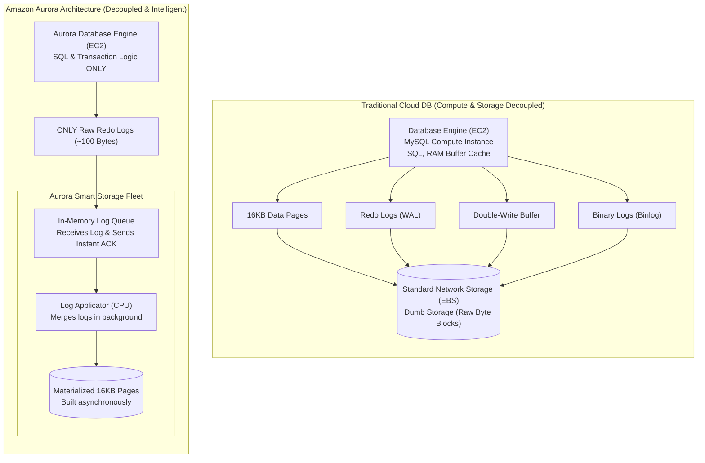

While working on a high-stakes project preparing for an IPO, our database demands scaled exponentially. We migrated to Amazon Aurora to handle the load. At first, it was just a managed service choice, but seeing how effortlessly it handled high-write traffic and replication lag left me fascinated. I decided to dive deep into the landmark **Amazon Aurora (SIGMOD '17)** paper and database internals to understand what made it tick.

What I discovered is a masterclass in distributed systems engineering. The way Aurora decouples compute from storage and completely flips traditional database design on its head is beautiful. I wanted to document my own process of breaking down these breakthroughs—partly to solidify my own understanding, and hopefully, to help other developers navigate concepts like *write amplification, double-write buffers, and log-based storage* without getting lost in dense academic jargon.

Let's start with the foundational challenge: **Why traditional databases suffer in cloud environments, and the architectural paradigm shift that resolved it.**

## 1. Groundwork: Separating Compute and Storage

To understand database architecture in the cloud, we must first establish the boundary between two core modules: **Compute** (the database engine) and **Storage**. 

Think of a database as a gourmet restaurant:

* **Compute (The Chefs & Waiters):** The database engine is responsible for interpreting and planning SQL queries (such as `SELECT` and `INSERT`), handling transaction locking, managing user access/permissions, and keeping active data pages hot in RAM within the **Buffer Cache**. This layer is volatile—if the server restarts, this cache is completely wiped.
* **Storage (The Pantry & Freezer):** The storage layer physically persists raw data blocks on non-volatile media (like SSDs or HDDs). It guarantees durability across system reboots and failures, and sends requested data blocks up to the Compute layer whenever they are needed.

In a traditional database setup (like running MySQL on your local laptop), compute and storage share the same physical server. In a cloud environment, however, cloud providers separate these concerns: your database compute engine runs on a virtual machine (such as Amazon EC2), while the database files are stored on remote, network-attached storage servers.

## 2. Scalability: The Shift from Scale-Up to Scale-Out

Historically, when a database hit its resource limits, the standard solution was **Scale-Up (Vertical Scaling)**—replacing the server with a larger one boasting more memory and a faster processor. 

However, hardware scalability has physical limits: it is impossible to scale a single server infinitely.

Modern cloud architecture instead embraces **Scale-Out (Horizontal Scaling)**—clustering groups of smaller, commodity servers linked over high-speed networks.

Distributing a database engine across a scale-out cloud environment changes the bottleneck equation:
1. Disk capacity and drive speed are no longer the limiting factors, as operations are divided among many parallel storage nodes.
2. **The network link connecting the compute nodes to the storage nodes becomes the system's primary performance bottleneck.**

## 3. The Bottleneck: Write Amplification and Network Congestion

To see why a classic database like MySQL runs inefficiently when decoupled in the cloud, let's trace what happens during a simple row update:
```sql
UPDATE users SET status = 'active' WHERE id = 5;
```

Because remote virtual disks (like AWS EBS) act as "dumb" block containers unaware of database structures or transaction logic, traditional MySQL must write multiple distinct pieces of data across the network to guarantee durability. 

Specifically, the compute node must blast several payloads over the network:
* **Redo Log Records (Write-Ahead Log):** The minimal delta instruction (~100 bytes) describing the change.
* **Modified Data Pages:** The entire 16KB data page containing the updated row.
* **Double-Write Buffer Pages:** Duplicate page writes sent to prevent page corruption in the event of an mid-write crash.
* **Binary Logs (Binlog):** Replication streams used for auditing and point-in-time recovery.
* **Metadata Files:** Schema updates (like FRM files).

This process represents **Traditional MySQL Cloud Routing**: the Compute Engine acts as the source, sending the Redo Log, the full 16KB Pages, the Double-Write buffer, and the Binlog over the network pipe to the dumb storage nodes.

This leads to massive **Write Amplification**. A 50-byte logical update causes kilobytes of redundant data to be repeatedly sent across network interfaces. Consequently, transaction threads must block while waiting for remote network write acknowledgments, producing latency spikes, throughput limits, and performance jitter.

## 4. The Core Solution: \"The Log is the Database\"

The engineers behind Amazon Aurora re-evaluated this flow with a simple realization:

> *"If a 100-byte Redo Log entry contains all the details necessary to reconstruct an updated page, why are we wasting network bandwidth sending the full 16KB page?"*

### The Book and the Post-It Analogy

To understand this concept, imagine a **16KB Data Page** as a **500-page physical book**, and a **Redo Log Record** as a tiny **Post-it note**.
* **The Page (The Book):** Holds 100 user profiles, contact details, and records.
* **The Redo Log (The Post-it Note):** Contains a single line: *"In chapter 2, update User 5's status to 'active'"*.

If you already own the previous edition of the book, applying the instructions on the Post-it note gets you the exact same result as replacing the entire 500-page book!

### Moving Log Application to Smart Storage

Aurora leverages this by decoupling compute from storage and replacing the passive disk layer with an **intelligent, database-aware storage fleet**.

Under **Aurora's Cloud Architecture**, the Compute Engine only streams the raw Redo Logs (~100 bytes) over the network pipe. The Smart Storage Fleet receives these logs, saves them, and handles page updates independently.

This works through a simple sequence:
1. **The Compute Node:** Generates and writes **only the raw redo log records** over the network.
2. **The Smart Storage Node:** Receives the lightweight log record, logs it to an in-memory queue, and returns a write acknowledgment back to compute immediately.
3. **Asynchronous Materialization:** In the background, the storage engine's own CPU processes the queued redo logs and merges them into the actual 16KB data pages on disk.



## 5. Architectural Benefits

Centering the database design around the principle that **"The Log is the Database"** yields major architectural wins:

* **90% Network I/O Reduction:** Blasting small logical deltas instead of full physical pages dramatically reduces network traffic.
* **Elimination of Checkpoint Stalls:** The compute engine no longer needs to flush large dirty data pages to disk, removing performance pauses.
* **Near-Instant Crash Recovery:** If the database compute node fails and reboots, it doesn't need to rebuild pages by parsing logs; the smart storage nodes have already applied them, shrinking recovery times to seconds.

## Architectural Comparison

| Architectural Aspect | Traditional Cloud MySQL | Amazon Aurora |
| --- | --- | --- |
| **Compute & Storage separation** | Coupled to local or remote dumb virtual disks. | Decoupled (Compute on VM, Storage on smart multi-tenant fleet). |
| **Primary System Bottleneck** | Disk read/write I/O and local CPU. | Network throughput between layers. |
| **Network Data Payload** | Redo logs, full 16KB data pages, double-write buffers, binary logs. | **Only raw redo log records**. |
| **Data Page Updates** | Compute engine flushes modified dirty pages to disk during checkpoints. | Smart storage nodes compile and merge pages asynchronously in the background. |

## Coming Up in Part 2...

By offloading log processing, Aurora optimizes normal read/write operations without saturating the network. But how does a decoupled database system survive physical node crashes and power outages?